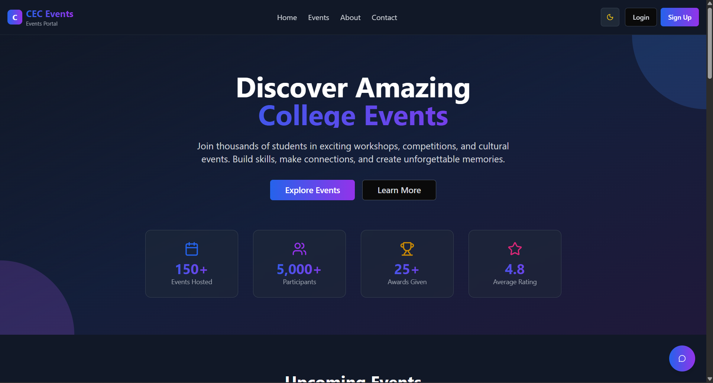

🎉 CEC Events Website

A web application built with React + Vite + TypeScript + TailwindCSS + shadcn/ui to showcase and manage college events.

This project includes an Admin Panel where events can be added, updated, or deleted.

## Features

- Event Management – Add, update, and delete events

- Modern UI – Built with shadcn/ui
 and TailwindCSS

- Admin Panel – Secure login for event admins

- Fast & Responsive – Powered by Vite + React

- Dark Mode Support

- Mobile-Friendly Design

## Tech Stack

- Frontend: React, TypeScript, Vite

- UI Components: shadcn/ui, Radix UI, TailwindCSS

- State Management: Zustand

- Form Handling: React Hook Form + Zod

- Icons: Lucide React

- Animations: Framer Motion

 ## Project Structure
 
├── public/              # Static assets
├── src/                 # Main source code
│   ├── components/      # Reusable UI components
│   ├── pages/           # Page-level components
│   ├── hooks/           # Custom React hooks
│   ├── store/           # Zustand state management
│   └── App.tsx          # Main App component
├── package.json         # Dependencies and scripts
├── tailwind.config.js   # TailwindCSS config
├── vite.config.ts       # Vite config
└── tsconfig.json        # TypeScript config

## Now open https://cecevents.netlify.app/
 🎉

 ## Future Improvements

 - Connect to a real backend (Node.js + MongoDB / Firebase) for global updates

 - Add authentication (JWT / Firebase Auth) for secure admin login

 - Add analytics dashboard for event statistics

 - Add email notifications for registered participants

## Screenshots

🤝 Contributing

Contributions are welcome! Fork the repo and create a pull request 